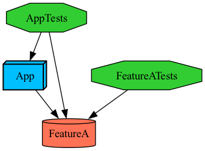

# Tuist test doesn't use cached targets.



`App` compiles in ~2 secs
`FeatureA` compiles in 10+ secs 

## Steps to reproduce:

1. Warm cache
```bash
tuist cache warm --xcframeworks
``` 
`FeatureA` should now be cached. 
2. Run tests.
```bash
tuist test --clean
``` 
Both `App` and `FeatureA` are expected to be tested.
3. Modify `App` module, go to `App/Sources/AppDelegate.swift` and uncomment the last line: 
```diff
+ func hello() {}
- //func hello() {}
``` 
This invalidates `App` caches, but `FeatureA` caches are still valid. 
4. Run tests again and measure the time.  
```bash
time tuist test --clean
``` 

## Expected result:

1. Since only `App` target was modified, we only expect `App` to be compiled and tested. 
1. Since `FeatureA` was NOT modified, we expect it to be replaced by cached xcframework, thus skipping both compilation and testing.

## Actual result:

`FeatureA` is only skipped for testing, but is STILL compiled. You can observe that the last step produces `[FeatureA] Compiling FeatureA_vers.c` in logs and takes 15+ seconds to complete.  
